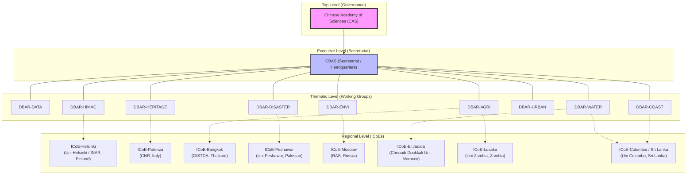

# DBAR Organisational Hierarchy

This diagram visualizes the structural relationship between the Chinese Academy of Sciences (CAS), the regional International Centres of Excellence (ICoEs), and the thematic Working Groups (WGs) that form the 'Scientific Silk Road'.

---

## Technical Appendix: Organisational Mapping

| Level | Entity | Role / Description |
| :--- | :--- | :--- |
| **Top Level** | CAS | Strategic oversight and primary funding body. |
| **Executive** | CBAS | Administrative headquarters and data infrastructure provider. |
| **Thematic** | Working Groups | Define research agendas and data standards for specific domains. |
| **Regional** | ICoEs | Physical interfaces for localised implementation and data collection. |
