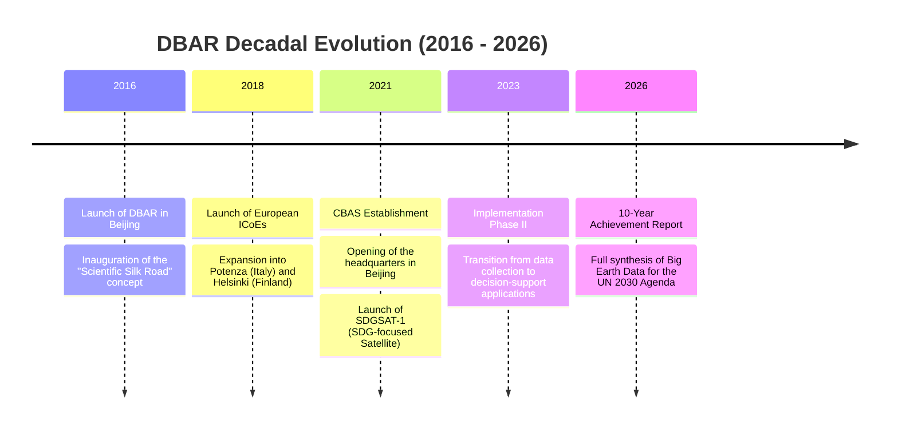

# DBAR Institutional Governance Timeline

This timeline tracks the evolution of the Digital Belt and Road (DBAR) programme from its inaugural launch in Beijing to its projected decadal synthesis.

---

## Phase Analysis

| Phase | Duration | Focus |
| :--- | :--- | :--- |
| **Phase I: Conceptualisation** | 2016 - 2020 | Establishing the ICoE network and data sharing protocols. |
| **Phase II: Implementation** | 2021 - 2025 | Launching dedicated infrastructure (CBAS, SDGSAT-1) and applying models to SDG targets. |
| **Synthesis** | 2026+ | Consolidating the "Scientific Silk Road" as a global standard for Earth observation. |
